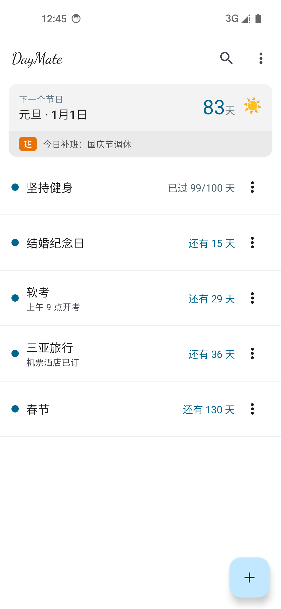
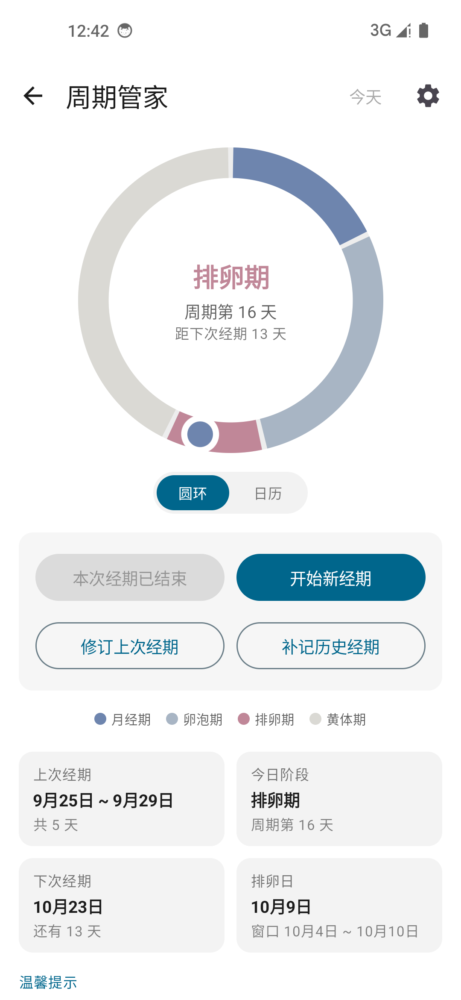
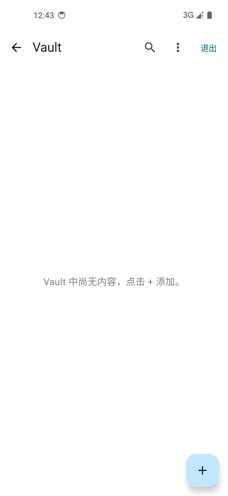

# DayMate

一款轻量的 Android 倒数日应用，记录你的期待与坚持。自己日常在用，顺手开源了。

[下载最新版](https://github.com/Ayaka7452/DayMate/releases)

## 界面一览

<div align="center">
  
  
  
  
</div>

## 能做什么

- **倒数日**：还有 N 天 / 已过 N 天，按天 / 月 / 年显示，支持对照日期与循环重复。
- **节日卡片**：法定节假日倒计时，休 / 班状态、连休天数一卡看清。
- **文件夹**：整理事件，批量管理。
- **Vault**：独立空间，密码 + 生物识别解锁，防截屏保护。
- **周期管家**：私密的经期记录与预测。
- **桌面小组件**：不打开应用也能看到最近倒数。
- **数据备份**：本地备份与 WebDAV 云同步。
- **应用内更新**：自动检查新版本并安装。
- **主题与语言**：浅色 / 深色主题，多套配色，六语言支持。

日常更新以体验优化和问题修复为主，具体变更见各版本 Release 说明。

## 构建

```bash
./gradlew assembleDebug
```

APK 输出：`app/build/outputs/apk/debug/`

GitHub Actions 在每次 push 到 `main` 时自动编译，可在仓库 Actions 页下载 artifact。

## 许可证

[MIT](LICENSE) © Ayaka7452
